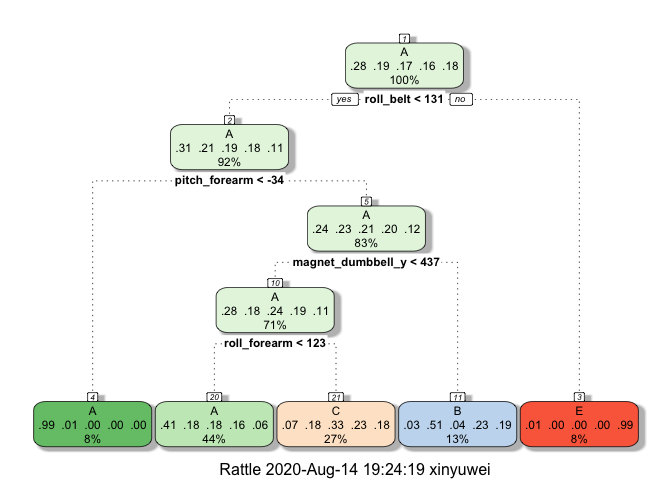

## Overview

This project aims to make prediction (and test how good our prediction is) on our experiment's subjects' behaviors based on the existing observations from the training set.The data is collected from weight lifting exercises from accelerometers on the belt, forearm, arm, and dumbell of 6 participants. The project cleans the data set by removing unrelated variables and creating cross validation data partition. After researched on decision tree, random forest and boosting models, the project found the random forest model with the highest accuracy (99%) and modeled the prediction on the test set. Note: the random forest model alone performs better than the combined model of random forest and bosting models.

## Preparation Work

### Set up the global environment

```r
library(knitr)
opts_chunk$set(fig.path = "Figs/", warning=FALSE, message = FALSE, echo=TRUE)
library(caret)
library(rattle)
```

### Load the data
Since I have already downloaded the data sets from online (the urls can be found through README.md file), here I just read them by coding:

```r
training <- read.csv("./data/pml-training.csv", na.strings = c("NA", "#DIV/0!", ""))
testing <- read.csv("./data/pml-testing.csv", na.strings = c("NA", "#DIV/0!", ""))
dim(training); dim(testing)
```

```
## [1] 19622   160
```

```
## [1]  20 160
```

### Clean the data set
Taking a look into the data sets (as shown below), I find that there are quite few variables got a large number of NAs, which might later give a false sense for our prediction.

```r
head(colSums(is.na(training)), 30)
```

```
##                    X            user_name raw_timestamp_part_1 
##                    0                    0                    0 
## raw_timestamp_part_2       cvtd_timestamp           new_window 
##                    0                    0                    0 
##           num_window            roll_belt           pitch_belt 
##                    0                    0                    0 
##             yaw_belt     total_accel_belt   kurtosis_roll_belt 
##                    0                    0                19226 
##  kurtosis_picth_belt    kurtosis_yaw_belt   skewness_roll_belt 
##                19248                19622                19225 
## skewness_roll_belt.1    skewness_yaw_belt        max_roll_belt 
##                19248                19622                19216 
##       max_picth_belt         max_yaw_belt        min_roll_belt 
##                19216                19226                19216 
##       min_pitch_belt         min_yaw_belt  amplitude_roll_belt 
##                19216                19226                19216 
## amplitude_pitch_belt   amplitude_yaw_belt var_total_accel_belt 
##                19216                19226                19216 
##        avg_roll_belt     stddev_roll_belt        var_roll_belt 
##                19216                19216                19216
```

Therefore, we have to get rid of them before prediction. I set the threshold as 95%, meaning that we will remove variables which contains more than 5% NAs. We will also remove some columns containing some unrelated data like user names and time.

```r
remainPart <- colSums(is.na(training))/nrow(training) < 0.95
training_after <- training[, remainPart]
training_after <- training_after[, -c(1:7)]
#do the same for testing data set
testing_after <- testing[, names(training_after)[1:52]]
dim(training_after); dim(testing_after)
```

```
## [1] 19622    53
```

```
## [1] 20 52
```

## Data Analysis

From the [original report](https://web.archive.org/web/20161224072740/http:/groupware.les.inf.puc-rio.br/har), the "classe" variable is described as below:  

Six young health participants were asked to perform one set of 10 repetitions of the Unilateral Dumbbell Biceps Curl in five different fashions:

* exactly according to the specification (Class A)
* throwing the elbows to the front (Class B)
* lifting the dumbbell only halfway (Class C)
* lowering the dumbbell only halfway (Class D)
* throwing the hips to the front (Class E)


```r
table(training_after$classe)
```

```
## 
##    A    B    C    D    E 
## 5580 3797 3422 3216 3607
```

```r
prop.table(table(training_after$classe))
```

```
## 
##         A         B         C         D         E 
## 0.2843747 0.1935073 0.1743961 0.1638977 0.1838243
```


### Set up cross validation
Since we already got the training and testing data set separately, we can partition the training set in order to create a separate set for **cross validation**.


```r
set.seed(2333)
inTrain <- createDataPartition(y = training_after$classe, p = 0.7, list = FALSE)
trainingData <- training_after[inTrain, ]
trainingData$classe <- as.factor(trainingData$classe)
crossValidation <- training_after[-inTrain, ]
crossValidation$classe <- as.factor(crossValidation$classe)
```

### Select Model and Prediction

#### Decision Tree Model

**1. set up the model and plot the tree**

```r
set.seed(23)
dtMod <- train(classe~., data = trainingData, method = "rpart")
fancyRpartPlot(dtMod$finalModel)
```

<!-- -->

**2. predict**

From our prediction, we find the **out of sample err** as 0.51, while the **accuracy** is 0.49 (or 49%), which means the decision tree model FAIL to meet our standard as a predictive model.


```r
dtPred <- predict(dtMod, newdata = crossValidation)
confusionMatrix(dtPred, crossValidation$classe)
```

```
## Confusion Matrix and Statistics
## 
##           Reference
## Prediction    A    B    C    D    E
##          A 1504  452  493  437  139
##          B   33  404   30  175  163
##          C  134  283  503  352  291
##          D    0    0    0    0    0
##          E    3    0    0    0  489
## 
## Overall Statistics
##                                           
##                Accuracy : 0.4928          
##                  95% CI : (0.4799, 0.5056)
##     No Information Rate : 0.2845          
##     P-Value [Acc > NIR] : < 2.2e-16       
##                                           
##                   Kappa : 0.3375          
##                                           
##  Mcnemar's Test P-Value : NA              
## 
## Statistics by Class:
## 
##                      Class: A Class: B Class: C Class: D Class: E
## Sensitivity            0.8984  0.35470  0.49025   0.0000  0.45194
## Specificity            0.6388  0.91551  0.78185   1.0000  0.99938
## Pos Pred Value         0.4972  0.50186  0.32182      NaN  0.99390
## Neg Pred Value         0.9406  0.85531  0.87899   0.8362  0.89004
## Prevalence             0.2845  0.19354  0.17434   0.1638  0.18386
## Detection Rate         0.2556  0.06865  0.08547   0.0000  0.08309
## Detection Prevalence   0.5140  0.13679  0.26559   0.0000  0.08360
## Balanced Accuracy      0.7686  0.63510  0.63605   0.5000  0.72566
```

#### Random Forest Model

**1. set up the model**

```r
set.seed(233)
rfControl <- trainControl(method = "cv", number = 4, p = 0.6)
rfMod <- train(classe~., method = "rf", data = trainingData, trControl = rfControl, 
               metric = "Accuracy", preProcess = c("center", "scale")); rfMod
```

```
## Random Forest 
## 
## 13737 samples
##    52 predictor
##     5 classes: 'A', 'B', 'C', 'D', 'E' 
## 
## Pre-processing: centered (52), scaled (52) 
## Resampling: Cross-Validated (4 fold) 
## Summary of sample sizes: 10302, 10303, 10303, 10303 
## Resampling results across tuning parameters:
## 
##   mtry  Accuracy   Kappa    
##    2    0.9900272  0.9873843
##   27    0.9895177  0.9867402
##   52    0.9850045  0.9810309
## 
## Accuracy was used to select the optimal model using the largest value.
## The final value used for the model was mtry = 2.
```

**2. predict**

From our prediction, we see an **out of sample err** less than 0.02, while the **accuracy** reaches nearly 99%. The random forest model stands for a successfully high accuracy rate.


```r
rfPred <- predict(rfMod, crossValidation)
confusionMatrix(rfPred, crossValidation$classe)
```

```
## Confusion Matrix and Statistics
## 
##           Reference
## Prediction    A    B    C    D    E
##          A 1669    8    0    0    0
##          B    2 1125   11    0    0
##          C    3    6 1011   34    0
##          D    0    0    4  929    2
##          E    0    0    0    1 1080
## 
## Overall Statistics
##                                           
##                Accuracy : 0.9879          
##                  95% CI : (0.9848, 0.9906)
##     No Information Rate : 0.2845          
##     P-Value [Acc > NIR] : < 2.2e-16       
##                                           
##                   Kappa : 0.9847          
##                                           
##  Mcnemar's Test P-Value : NA              
## 
## Statistics by Class:
## 
##                      Class: A Class: B Class: C Class: D Class: E
## Sensitivity            0.9970   0.9877   0.9854   0.9637   0.9982
## Specificity            0.9981   0.9973   0.9912   0.9988   0.9998
## Pos Pred Value         0.9952   0.9886   0.9592   0.9936   0.9991
## Neg Pred Value         0.9988   0.9971   0.9969   0.9929   0.9996
## Prevalence             0.2845   0.1935   0.1743   0.1638   0.1839
## Detection Rate         0.2836   0.1912   0.1718   0.1579   0.1835
## Detection Prevalence   0.2850   0.1934   0.1791   0.1589   0.1837
## Balanced Accuracy      0.9976   0.9925   0.9883   0.9812   0.9990
```

#### Boosting Model

**1. set up the model and plot the tree**

```r
gbmMod <- train(classe~., data = trainingData, method = "gbm", verbose = FALSE)
```

**2. predict**

We can see an **out of sample err** less than 0.05, while the **accuracy** is approximately 95.68%. The gradient boosting model, although not as good as random forest, is pretty satisfying at prediction.


```r
gbmPred <- predict(gbmMod, newdata = crossValidation)
confusionMatrix(gbmPred, crossValidation$classe)
```

```
## Confusion Matrix and Statistics
## 
##           Reference
## Prediction    A    B    C    D    E
##          A 1638   26    0    1    2
##          B   23 1072   38    3   21
##          C   10   40  969   42    6
##          D    3    0   17  911   12
##          E    0    1    2    7 1041
## 
## Overall Statistics
##                                           
##                Accuracy : 0.9568          
##                  95% CI : (0.9513, 0.9619)
##     No Information Rate : 0.2845          
##     P-Value [Acc > NIR] : < 2.2e-16       
##                                           
##                   Kappa : 0.9454          
##                                           
##  Mcnemar's Test P-Value : 5.412e-07       
## 
## Statistics by Class:
## 
##                      Class: A Class: B Class: C Class: D Class: E
## Sensitivity            0.9785   0.9412   0.9444   0.9450   0.9621
## Specificity            0.9931   0.9821   0.9798   0.9935   0.9979
## Pos Pred Value         0.9826   0.9265   0.9082   0.9661   0.9905
## Neg Pred Value         0.9915   0.9858   0.9882   0.9893   0.9915
## Prevalence             0.2845   0.1935   0.1743   0.1638   0.1839
## Detection Rate         0.2783   0.1822   0.1647   0.1548   0.1769
## Detection Prevalence   0.2833   0.1966   0.1813   0.1602   0.1786
## Balanced Accuracy      0.9858   0.9616   0.9621   0.9693   0.9800
```

#### Combined Model

Now we try to combine the random forest model with our boosting model and see whether the accuracy could be raised.


```r
tempdf <- data.frame(rfPred, gbmPred, classe = crossValidation$classe)
comMod <- train(classe~., data = tempdf, method = "rf")
comPred <- predict(comMod, newdata = crossValidation)
confusionMatrix(comPred, crossValidation$classe)$overall
```

```
##       Accuracy          Kappa  AccuracyLower  AccuracyUpper   AccuracyNull 
##      0.9879354      0.9847379      0.9848062      0.9905658      0.2844520 
## AccuracyPValue  McnemarPValue 
##      0.0000000            NaN
```

### Test Set and Result

Now that we find our best-performed predictive model, we now run it through our test data. Here, we see the same relatively high frequency of class A and class B.

```r
testPred <- predict(rfMod, newdata = testing_after)
# We can have a look of the frequency
table(testPred)
```

```
## testPred
## A B C D E 
## 7 8 1 1 3
```

```r
prop.table(table(testPred))
```

```
## testPred
##    A    B    C    D    E 
## 0.35 0.40 0.05 0.05 0.15
```
